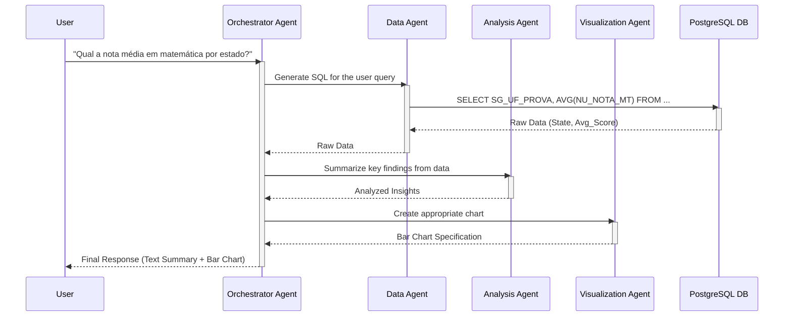

# **Feature Requirements Document (FRD) \- AI Data Analyst**

Version: 1.0  
Date: June 9, 2024  
Author: Gemini  
Source PRD: AI Data Analyst PRD v1.0

### **1\. Introduction**

This document provides a detailed breakdown of the features required for the Minimum Viable Product (MVP) of the AI Data Analyst platform. It translates the high-level requirements from the PRD into specific, actionable items for the development team.

### **2\. Feature Overview**

The platform is comprised of three core components: a multi-agent backend, a data backend, and a user-facing frontend.

| Feature ID | Feature Name | Component | Priority |
| :---- | :---- | :---- | :---- |
| **F01** | Conversational Query Interface | Frontend (Streamlit) | High |
| **F02** | Multi-Source Data Visualization | Frontend (Streamlit) | High |
| **F03** | Query Transparency | Frontend (Streamlit) | High |
| **F04** | Agent-based Query Processing | Backend (Google ADK) | High |
| **F05** | Natural Language to SQL | Backend (Google ADK) | High |
| **F06** | Multi-Year & Correlational Analysis | Backend (Google ADK) | High |
| **F07** | Data Storage and Access | Data Backend (PostgreSQL) | High |
| **F08** | Security and Privacy Guardrails | Backend & Model | High |

### Agent Communication Flow

### **3\. Detailed Feature Requirements**

#### **F01: Conversational Query Interface**

* **F01.1:** The UI must present a clean, minimalist chat interface with a single text input box at the bottom or top of the screen.  
* **F01.2:** The user shall be able to type questions in natural Portuguese and submit them by pressing "Enter" or clicking a "Submit" button.  
* **F01.3:** The chat history must be displayed in the main window, with user queries and agent responses clearly distinguished (e.g., alignment, background color).  
* **F01.4:** While the agent is processing a query, a visual indicator (e.g., a spinner or "Processing..." message) must be displayed to the user.

#### **F02: Multi-Source Data Visualization**

* **F02.1:** The agent's response must appear as a new message in the chat interface.  
* **F02.2:** Responses must contain a textual summary of the findings.  
* **F02.3:** When applicable, responses must include an interactive data visualization (chart or table) rendered directly below the text summary.  
* **F02.4:** The Visualization Agent must be ableto select the appropriate chart type:  
  * **Bar Chart:** for comparing categories.  
  * **Line Chart:** for showing trends over time (longitudinal/multi-year analysis).  
  * **Scatter Plot:** for showing correlation between two numeric variables.  
  * **Table:** for displaying raw or aggregated data points.  
* **F02.5:** The user must be able to download any generated chart as a PNG file via a button or link.

#### **F03: Query Transparency**

* **F03.1:** Each agent response containing data must include a "Show SQL Query" button or expandable section.  
* **F03.2:** Clicking this button will reveal the exact SQL query that was executed against the database to generate the result.  
* **F03.3:** The displayed SQL must be formatted for readability (e.g., with syntax highlighting).

#### **F04: Agent-based Query Processing**

* **F04.1:** An **Orchestrator Agent** must be implemented to receive the initial user query.  
* **F04.2:** This agent must be able to break down the query and delegate tasks to specialized agents (Data, Analysis, Visualization).  
* **F04.3:** This agent is responsible for synthesizing the results from other agents into a single, coherent response for the user.

#### **F05: Natural Language to SQL**

* **F05.1:** A **Data Agent** must be implemented.  
* **F05.2:** This agent must accept a natural language request and the target database schema as input.  
* **F05.3:** It must output a syntactically correct and logically sound PostgreSQL query.  
* **F05.4:** The agent must correctly map entities from the user's query to the correct tables and columns in the database (e.g., "nota de matemática" \-\> NU\_NOTA\_MT).

#### **F06: Multi-Year & Correlational Analysis**

* **F06.1:** The Data Agent must be able to generate queries that span multiple years of data (e.g., using UNION ALL on tables like enem\_2022, enem\_2023).  
* **F06.2:** The Data Agent must be able to generate queries that join the enem data with censo\_escolar data on the school's unique identifier (CO\_ESCOLA).  
* **F06.3:** The Analysis Agent must be able to perform calculations appropriate for these queries (e.g., year-over-year growth, correlation coefficients).

#### **F07: Data Storage and Access**

* **F07.1:** A PostgreSQL database must be used to store all microdata.  
* **F07.2:** The database schema, as defined in Section 4, must be implemented.  
* **F07.3:** An initial data ingestion script must be created to load the ENEM 2023 and Censo Escolar 2023 CSVs into the database. Future years will be added as new tables.  
* **F07.4:** All tables must be indexed on foreign keys and columns frequently used in WHERE clauses (e.g., NU\_ANO, SG\_UF\_PROVA, TP\_ESCOLA) to ensure query performance.

#### **F08: Security and Privacy Guardrails**

* **F08.1:** The database connection user for the application must have READ-ONLY permissions.  
* **F08.2:** An input validation function must be implemented to check all generated SQL to ensure it is a SELECT query before execution.  
* **F08.3:** The Gemini model's safety settings for Harmful Content categories must be configured to BLOCK\_MEDIUM\_AND\_ABOVE.  
* **F08.4:** A post-query check must be implemented. If a query result contains fewer than 10 records, the data will be withheld, and a privacy notice will be displayed to the user.

### **4\. Database Model (MVP)**

Based on the Dicionário\_Microdados\_Enem\_2023.xlsx file, the following tables and columns are proposed for the MVP. This is a subset of the available data, focusing on the most relevant variables for initial analysis.

#### **Table: enem\_2023**

| Column Name | Data Type | Description | Original Variable |
| :---- | :---- | :---- | :---- |
| NU\_INSCRICAO | BIGINT PRIMARY KEY | Unique participant inscription number. | NU\_INSCRICAO |
| NU\_ANO | INTEGER | Year of the exam. | NU\_ANO |
| TP\_FAIXA\_ETARIA | INTEGER | Age group of the participant. | TP\_FAIXA\_ETARIA |
| TP\_SEXO | VARCHAR(1) | Sex of the participant ('F' or 'M'). | TP\_SEXO |
| TP\_ESTADO\_CIVIL | INTEGER | Marital status. | TP\_ESTADO\_CIVIL |
| TP\_COR\_RACA | INTEGER | Color/Race. | TP\_COR\_RACA |
| TP\_NACIONALIDADE | INTEGER | Nationality. | TP\_NACIONALIDADE |
| TP\_ST\_CONCLUSAO | INTEGER | High school completion status. | TP\_ST\_CONCLUSAO |
| TP\_ANO\_CONCLUIU | INTEGER | Year of high school completion. | TP\_ANO\_CONCLUIU |
| TP\_ESCOLA | INTEGER | Type of school (public/private). | TP\_ESCOLA |
| TP\_ENSINO | INTEGER | Type of education. | TP\_ENSINO |
| SG\_UF\_PROVA | VARCHAR(2) | State (UF) where the exam was taken. | SG\_UF\_PROVA |
| NO\_MUNICIPIO\_PROVA | VARCHAR(150) | Municipality where the exam was taken. | NO\_MUNICIPIO\_PROVA |
| NU\_NOTA\_CN | NUMERIC(10, 2\) | Natural Sciences score. | NU\_NOTA\_CN |
| NU\_NOTA\_CH | NUMERIC(10, 2\) | Human Sciences score. | NU\_NOTA\_CH |
| NU\_NOTA\_LC | NUMERIC(10, 2\) | Languages and Codes score. | NU\_NOTA\_LC |
| NU\_NOTA\_MT | NUMERIC(10, 2\) | Mathematics score. | NU\_NOTA\_MT |
| NU\_NOTA\_REDACAO | NUMERIC(10, 2\) | Essay score. | NU\_NOTA\_REDACAO |
| Q001 \- Q025 | VARCHAR(1) | Socioeconomic questionnaire responses. | Q001 \- Q025 |

*(Note: Additional enem\_YYYY tables will be created with a similar structure for multi-year analysis. The Socioeconomic Questionnaire columns Q001-Q025 will be included but may require a separate lookup table for their descriptions in a future version.)*

*(Note: We will omit the ITENS\_PROVA\_2023 data for the MVP as it pertains to individual question performance, which is a more advanced use case.)*

#### **Table: censo\_escolar\_2023 (Example subset)**

| Column Name | Data Type | Description |
| :---- | :---- | :---- |
| CO\_ENTIDADE | INTEGER PRIMARY KEY | Unique School ID (to be joined with CO\_ESCOLA). |
| NO\_ENTIDADE | VARCHAR(255) | School Name. |
| TP\_DEPENDENCIA | INTEGER | Dependency (Federal, State, Municipal). |
| IN\_AGUA\_POTAVEL | BOOLEAN | Has drinkable water. |
| IN\_ENERGIA\_PUBLICA | BOOLEAN | Has public electricity. |
| IN\_INTERNET | BOOLEAN | Has internet access. |
| IN\_BANDA\_LARGA | BOOLEAN | Has broadband internet. |
| IN\_LABORATORIO\_CIENCIAS | BOOLEAN | Has science laboratory. |
| IN\_BIBLIOTECA | BOOLEAN | Has library/reading room. |

